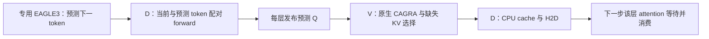

# OasisKV 思路在 P/V/D 上的首轮实验

分支：`codex/pvd-oasiskv`；独立目录：`D:\code\sglang-V100-PVD-oasiskv`。
本次完成独立实验入口及真实跨节点测试，尚未接入现有 SGLang Scheduler。

## 实现范围

- P 使用真实 Qwen2.5-7B 生成 Prompt KV、EAGLE3 所需的三个目标层特征和
  已知首 token，并额外算首 token 的目标 Q。完整 KV 仅交给 V。
- D 从 V 获得特征和初始检索所需的首 token Q，再向 V 拉取初始稀疏 KV。
  没有 P→D KV，也没有 D 端完整 Prompt KV 预热。
- 专用 EAGLE3 每次预测一个未来 token。目标模型将当前 token 与这个 token
  作为两行共享 QKV 投影、attention 和 MLP；每层 RoPE 后立即发布预测 Q。
- 预测行使用当前行的驻留稀疏 KV，也能访问当前真实 K/V 和自己的私有 K/V。
  当前行看不到未来 K/V；只提交当前行的 K/V、token 和目标辅助特征。
- V 每层执行原生 CAGRA 查询、保留已驻留的交集、限制新换入数量，并仅发送
  D CPU cache 中缺失的行。D 使用独立 CUDA stream 做 Q 的 D2H、KV 的 H2D。
- 下一步只等待正在消费的层；关闭会取消未开始的工作并等待已开始的操作终结。

这是 [OasisKV](https://arxiv.org/html/2608.08097v1) 的逐层 lookahead 流水线适配。
论文在 D 用块摘要选择 KV；本实验保留独立 V 上的 ANN，并以 token 行为单位。
实验传输是 HTTP 二进制协议，未复用生产 Mooncake/RDMA 协议。



## 公平比较

Qwen2.5-7B FP16、同一份专用 EAGLE3 权重；V100S，每个角色只使用 GPU1。
P 准备阶段结束后释放 GPU；在线实验为一张 V GPU 和一张 D GPU。
V 在一张 GPU 上覆盖全部 28 层、4 KV heads，共 28 个四合一图，使用固定
head 均值中心化、exact degree16 seed 和 native CAGRA，`itopk_size=2048`。
本次不是现有双 V rank 的性能测量。

每个 KV head 最多驻留 128 个 Prompt token，每步最多换入 16 个，
每个 Q head 查 Top16；一层 7 个 Q head 的结果合并后选取 KV。
D 使用两个预取工作线程；CPU cache 在单请求内保留已下载的行，并有完整
Prompt 大小的显式上限。真实 Decode 历史的 K/V 始终留在 D。

三组输入为固定 calibration 的数学题 141 tokens、阅读题 1372 tokens，
以及既有 Case40 的 2155-token 合成序列。每组先暖两种模式，再按
`serial → overlap → overlap → serial` 跑 16 步强制目标 token 轨迹。

串行模式在整次 paired forward 完成后启动检索，并等所有层完成。
重叠模式逐层发布 Q，下一步逐层等待。两者的模型计算、Q、预算均相同。
计时包含 Draft、paired target forward、Q 拷贝、RPC、V 服务、KV 拷贝及消费等待；
不包含模型加载、P Prefill、图构建、初始 bank、计时后的质量计算。

原生 CAGRA 的实时选择在合成输入上有抖动，第一轮触发了公平性检查失败。
因此正式计时先记录第一轮选择，其余轮仍执行全部 native searches，但使用
相同的 KV IDs，并逐查询校验 Q 的 SHA256。四轮实际/预测 tokens、bank 顺序、
KV 网络字节和 H2D 字节全部一致。含时间字段的诊断 HTTP header 长度可以不同。
另外的自由生成测试采用实时选择，不重放 IDs，并在 EOS 处停止。

## Decode 时间

每个模式仅两次暖运行；以下为每步耗时中位数，不是相对现有 serving 的加速比。

| Prompt tokens | 串行 ms/步 | 逐层重叠 ms/步 | 时间减少 | 16 步节省 |
|---:|---:|---:|---:|---:|
| 141 | 168.32 | 143.05 | 15.01% | 0.404 s |
| 1372 | 230.28 | 202.78 | 11.95% | 0.440 s |
| 2155 | 226.47 | 201.25 | 11.13% | 0.403 s |

| Prompt tokens | 串行消费等待 ms/步 | 重叠消费等待 ms/步 | 消费前已就绪的层比例 |
|---:|---:|---:|---:|
| 141 | 132.86 | 89.16 | 9.88% |
| 1372 | 194.00 | 150.41 | 3.57% |
| 2155 | 190.66 | 149.38 | 2.02% |

两次运行均显示剩余等待较多。后续运行的 V 服务也有变慢，原始两次结果均
保留；样本不足以据此给出稳定的生产收益或延迟分位数。

### 重叠模式的阶段均值

单位 ms；前三个服务字段按一次 layer 请求计算。RPC 包含 V 服务及回传，
V search/queue 是其中一部分，不能把这些列相加。bank 准备包含驻留行 GPU
复制、分配、H2D 与完成等待，不是纯 PCIe 传输耗时。

| Prompt tokens | Q D2H | RPC 全程 | V search | V queue | H2D/bank 准备 | 单步 Draft |
|---:|---:|---:|---:|---:|---:|---:|
| 141 | 0.168 | 8.507 | 4.578 | 1.742 | 1.961 | 4.812 |
| 1372 | 0.186 | 13.236 | 6.845 | 4.023 | 1.728 | 3.545 |
| 2155 | 0.187 | 13.071 | 6.619 | 3.541 | 1.764 | 3.057 |

逐层请求与 V 的四次 filtered searches 是显著开销；one-token 的时间窗口
只能遮住一部分服务时间。原型还逐层进行 Python/JSON 操作，不能直接把它的
RPC 全程当作生产网络延迟。独立 Q-copy stream 修复后未看到明显额外收益，
修复前的对照亦保留，支持继续优先排查 V 服务及请求粒度。

## 初始等待与流量

当前入口先等 V 完成全部图，再创建 D 的初始 bank。因此还没有验证在图
构建期间启动 D。这是 ANN 适配与论文摘要选择不同的一项启动限制。

| Prompt tokens | V 图构建实测 s | 图就绪后的 D bootstrap s | P 特征 seed 字节 | 15 轮检索 KV 网络字节 | H2D KV 字节 |
|---:|---:|---:|---:|---:|---:|
| 141 | 0.806 | 0.233 | 3,032,064 | 3,602,944 | 3,603,456 |
| 1372 | 1.243 | 0.407 | 29,503,488 | 6,459,392 | 6,724,096 |
| 2155 | 1.651 | 0.480 | 46,341,120 | 8,464,384 | 9,437,696 |

bootstrap 含特征交接、EAGLE prefix 缓存、初始稀疏查询和安装；这些不是客户端
TTFT。同一轮不会让已缓存的 KV 行再次过网络，但 CPU 已缓存、GPU 已被换出的
行仍需再次 H2D。GPU 驻留的行通过 GPU 复制复用。

计时版本的 seed 使用了 teacher-Q tensor 的 view，`torch.save` 意外带上了
全部 backing storage，约多 3.2 MiB。D 代码仅访问已知 root Q，没有读取未来 Q。
最终版本已 clone root Q，并让自由生成 seed 不携带 teacher tokens；CPU 真实
fixture 序列化检查确认存储范围正确。表中的 bootstrap 保留修复前实测，未将
修复后的字节减少换算成未经测量的时间收益。稳态 Decode 计时不含此 seed。

## 质量与新问题

质量在计时结束后用 P 的完整 KV 和真实目标 Q 评估，只取 EOS 前有效位置；
数学和合成输入受 16 步上限截断。指标是当前工作集对真实 Q Top10 的覆盖率，
不是 CAGRA 本身的 ANN recall，也不是最终答案准确率。

| Prompt tokens | 有效位置 | 工作集 Top10 覆盖率 | 最差单查询 | Draft 下一 token 一致率 |
|---:|---:|---:|---:|---:|
| 141 | 16 | 0.99094 | 0.3 | 0.625 |
| 1372 | 5 | 0.92439 | 0.0 | 0.0 |
| 2155 | 16 | 0.90645 | 0.0 | 0.1875 |

在固定轨迹的 16 步上，稀疏 D 选出的下一 token argmax 都与完整 KV 参考一致。
实时自由生成的阅读输出为 `FINAL: Berenberg Bank`，与参考一致并在 EOS 停止；
数学只有解题前缀，不能判定最终答案。不能据此宣称解决了 40 题质量差距。

额外的 live 原生重复查询检查固定了 query 的字节，8 次重复、3 个层、4 个
KV heads 中，相对首轮有 11 个 head-selection 变化，既有顺序变化也有集合
变化。第一轮合成输入的这种变化进一步引起一次 Draft 预测 token 变化。
这证明变化能够出现在 V 初始选择阶段，尚不能仅凭此断定是分数 ties。

后续需要处理的实际问题：

1. 一步 lookahead 遮不住当前 V 服务时间；跨节点逐层 RPC 与原生搜索需要降低
   固定开销，并评估双 rank，而不是直接扩大 Draft 层数。
2. 预测 token 错误、稀疏上下文误差和实时 ANN 选择抖动会共同影响预取。
   已知 root Q 与未来预测 Q 的质量必须分别测量。
3. 46 MB 级特征 handoff 是独立的启动成本；initial sparse KV 与图 READY
   解耦尚未实现。
4. 现有 Scheduler 的整次 forward bank lease 不能直接逐层替换；接入 serving
   需要明确每层 bank、copy event、取消及并发请求的所有权。

## 验证与复现

四个 CPU 状态机检查通过：逐层等待、旧回复/replay、关闭 drainage、驻留交集
及新行预算。真实 GPU 检查中，改变预测 token 后实际 logits/特征逐位一致；
每层只写入一行实际 K/V。与 HF 单 token 首轮输出的最大 logits 差异为
0.0234–0.0313，argmax 一致；FP16 辅助特征最大差异为 0.125。

CloudLab 三台节点的隔离目录为
`$SGLANG_PVD_ROOT/validation/pvd-oasiskv-20261001`；artifact 在
`$SGLANG_PVD_ROOT/validation/oasiskv-20261001`。V 的 fixtures、D 的专用 EAGLE
源码/权重均已放置；修改代码时需同步相应角色的独立目录。

```bash
# P：准备 fixture；完成后将 fixtures 复制给 V。
bash benchmark/run_pvd_oasis_cloudlab.sh prepare
# V：保持前台运行；原型仅绑定 10.10.1.2:38931。
bash benchmark/run_pvd_oasis_cloudlab.sh serve
# D：包含 warmup、反向顺序计时和 EOS-bounded 自由生成。
bash benchmark/run_pvd_oasis_cloudlab.sh decode
```

测试完成后本任务的 V 服务和 staging HTTP 服务已停止，GPU 已释放。
原始输出、逐层时间、失败轮、源码版本和指纹位于
`pvd_oasis_cloudlab_20261002/`。完整模型、Prompt-KV fixtures 不进 Git，保留
其指纹及可重生成脚本。原始实验运行 commit 为 `d0f83e1d8`；之后的 resident
交集修复对本次 Top16×7≤128 的形状不改变选择，seed 修复有独立 CPU 验证。
